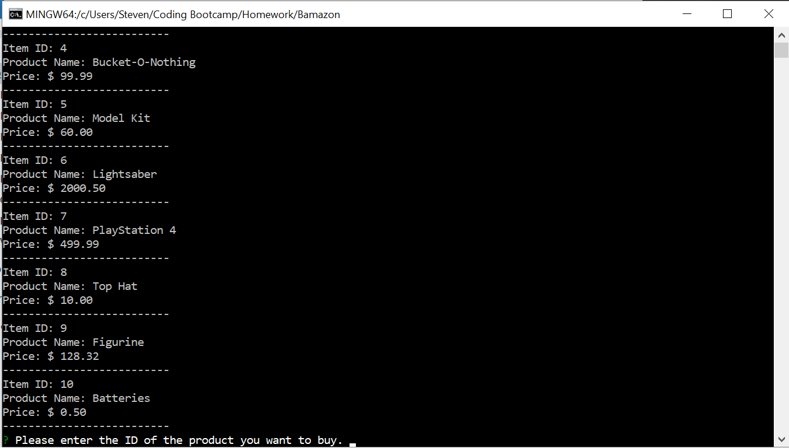

# Bamazon
An MySQL and node.js exercise 

Bamazon is a Command Line Interface App with 3 commands:
- bamazonCustomer.js
    - This app will first display all items avaliable for purchase: id, name and price
    
    - User is presented with 2 questions:
        - enter product ID of the item they wish to buy
        - enter the amount they wish to buy
    - Total cost will be displayed and changes will be updated in the database
- bamazonManager.js
    - This app will provide a list of options
        - *insert screen shot here*

- bamazonSupervisor.js
    - This app will provide 2 options
        - *insert screenshot here*

##### Note: 
- This is a simple app and therefore all commands can be accessed without need for authentication
- This app also assumes correct input

#### Install
1) clone repo and enter npm install in terminal
2) Have a MYSQL server running (MAMP is useful to have)
3) Make sure it is using LocalHost and port 3306 

#### Dependencies
* console.table
    * https://www.npmjs.com/package/console.table
* mysql
    * https://www.npmjs.com/package/mysql
* inquirer
    * https://www.npmjs.com/package/inquirer